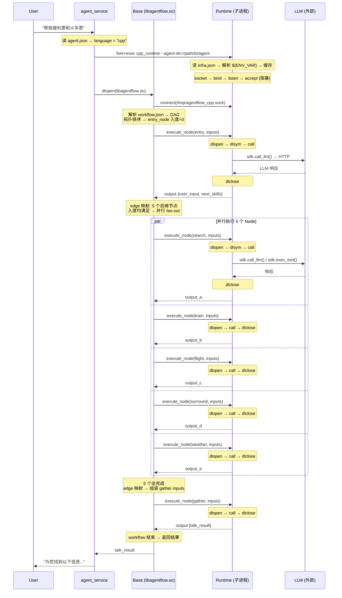
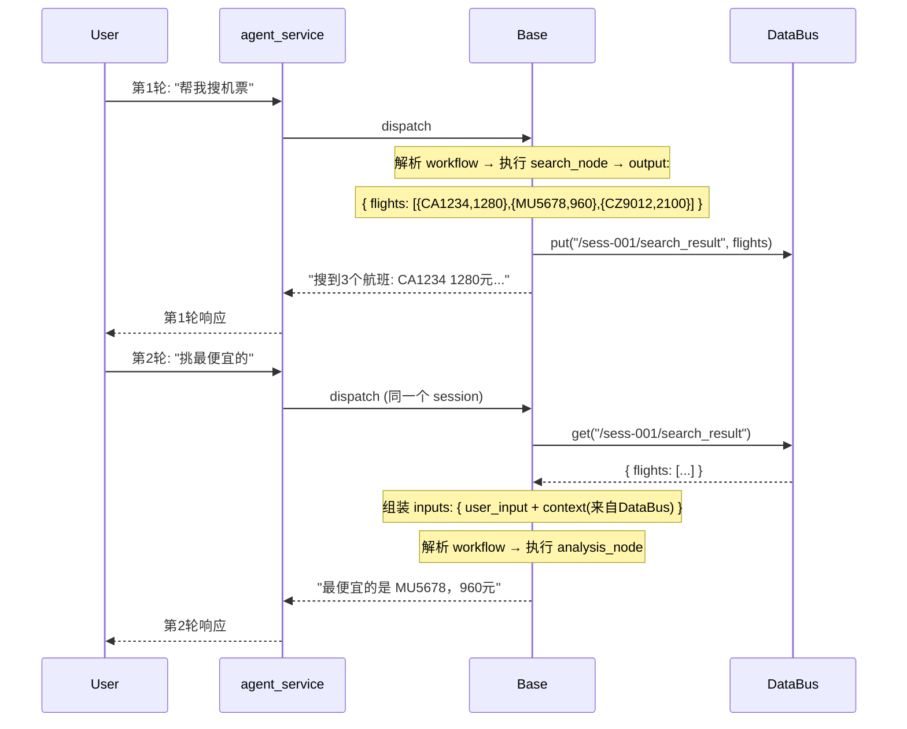

# AgentFlow 三层架构重构方案

## 1. 背景与目标

**当前 V3 架构问题**：

| 问题 | 现状 |
|------|------|
| cgo 依赖 | Go SDK 通过 cgo 调用 C++，编译慢、调试难、跨平台差 |
| 逻辑重复 | LLM/Skill/Tool/Context 在 C++/Rust/Go 中各实现一遍 |
| 底座能力不足 | 只提供 DataBus，编排、调度能力未以服务形式暴露 |
| 配置散落 | LLM api_key 硬编码在 C++ 源码；第三方 API key 硬编码在 Python 源码 |

**目标**：消除 cgo，AgentFlow 细化为清晰的三层——底座提供基础设施 + 编排，SDK+Runtime 提供通用能力，Agent 层只关注业务逻辑。

---

## 2. 关键决策

| # | 决策点 | 结论 |
|---|--------|------|
| ① | SDK 实现方式 | 三种语言各写一份（C++ 纯虚类 / Rust trait / Go interface） |
| ② | SDK 接口范围 | `call_llm` / `load_skill` / `exec_tool` / `exec_skill`（4 个，**不含 databus**） |
| ③ | Node 模型 | 纯函数 `output = f(inputs, sdk)`——无状态、不碰 DataBus、不知道 Base |
| ④ | Runtime 职责 | **只做 .so 生命周期管理**：load → call → unload。不编排、不映射 edge、不碰 DataBus |
| ⑤ | Runtime 部署 | AgentFlow 提供 3 种 Runtime 二进制（C++ / Rust / Go），agent_service 根据 agent.json 的 `language` 字段只启动对应的一个 |
| ⑤+ | agent_service | 最外层进程：加载 libagentflow.so（Base）+ 启动对应语言 Runtime，管生命周期（启动/握手/崩溃重启） |
| ⑥ | Base 职责 | **唯一编排中心**：DAG 解析 → 拓扑排序 → edge 映射 → 并行调度 → 数据路由 → 管理 DataBus |
| ⑦ | 一次 Node 执行 | 一次 UDS 往返：Base 发 execute_node，Runtime load/call/unload，返回 output |
| ⑧ | DataBus 归属 | Base 内部组件，仅用于跨对话轮次的 Session 状态持久化。同 workflow 内数据流转不经过 DataBus |
| ⑨ | Go .so 加载 | `go build -buildmode=plugin` → Go Runtime 用 `plugin.Open()` 加载，**零 cgo** |
| ⑩ | Rust .so 加载 | `cdylib` + `extern "C"` → Rust Runtime 用 `dlopen()` 加载 |
| ⑪ | C++ .so 加载 | C++ Runtime 用 `dlopen()` 加载，原生零开销 |
| ⑫ | 单 Agent 语言约束 | 同一 Agent 内所有 Node 编译为同一语言的 .so |

---

## 3. 三层架构总览

```
┌─────────────────────────────────────────────────────────────────────────────┐
│  外部入口：agent_service（进程）                                               │
│                                                                             │
│  1. 读 agents/<name>/agent.json → 解析 language / tasks / workflows         │
│  2. fork + exec → 启动对应语言 Runtime（传 --agent-dir）                      │
│  3. dlopen("libagentflow.so") → 加载底座，传入 agent.json                    │
│  4. 生命周期管理：等 Runtime 握手、信号处理、崩溃重启                            │
│                                                                             │
│     ┌── 启动 Runtime ───────────────────────────────────────────────┐       │
│     │                ┌── dlopen Base ──┐                             │       │
│     │                │                 │                             │       │
│     │                ▼                 │                             │       │
│     │  ┌───────────────────────────────────────────────────────┐    │       │
│     │  │         底座层（libagentflow.so，C++）                  │    │       │
│     │  │                                                       │    │       │
│     │  │  ┌─ Workflow 引擎 ─────────────────────────────────┐  │    │       │
│     │  │  │ ① 解析 workflow.json → 构建 DAG                  │  │    │       │
│     │  │  │ ② 拓扑排序（Kahn 算法）                          │  │    │       │
│     │  │  │ ③ 入度检查 → get_executable_nodes()             │  │    │       │
│     │  │  │ ④ edge 映射 → 从上游 output 组装下游 inputs      │  │    │       │
│     │  │  │ ⑤ 并行 fan-out → 同批可执行 Node 并发发给 Runtime│  │    │       │
│     │  │  │ ⑥ 数据路由 → 收 output，分发给后续 Node           │  │    │       │
│     │  │  └─────────────────────────────────────────────────┘  │    │       │
│     │  │                                                       │    │       │
│     │  │  ┌─ DataBus ───────────────────────────────────────┐  │    │       │
│     │  │  │ ⑦ KV 存储（5 命名空间：sys/ctx/llm/tool/user）    │  │    │       │
│     │  │  │ ⑧ 仅用于跨对话轮次的 Session 级状态持久化         │  │    │       │
│     │  │  └─────────────────────────────────────────────────┘  │    │       │
│     │  │                                                       │    │       │
│     │  │  ┌─ Session / Task 管理 ───────────────────────────┐  │    │       │
│     │  │  │ ⑨ 生命周期（session 创建/销毁、dialogue 跟踪）    │  │    │       │
│     │  │  │ ⑩ 并发控制（thread pool、max_concurrent_nodes）  │  │    │       │
│     │  │  └─────────────────────────────────────────────────┘  │    │       │
│     │  │                                                       │    │       │
│     │  │  ┌─ UDS Client ─────────────────────────────────────┐ │    │       │
│     │  │  │ connect(sock) → send(execute_node) → recv(output) │ │    │       │
│     │  │  └───────────────────┬──────────────────────────────┘ │    │       │
│     │  └──────────────────────┼────────────────────────────────┘    │       │
│     └─────────────────────────┼─────────────────────────────────────┘       │
│                               │                                              │
│  底座 ── UDS ── Runtime       │  UDS (AF_UNIX socket, JSON)                  │
│  交互关系：                    │  只有一种消息：execute_node                    │
│  底座是客户端，主动 connect    │  UDS 不传 infra / api_key                     │
│  Runtime是服务端，被动 accept  │                                              │
│                               │                                              │
│  ┌────────────────────────────┼──────────────────────────────────────────┐   │
│  │      Runtime 层（独立子进程，被动等待）                                  │   │
│  │                                                                        │   │
│  │  ┌──────────────────────────────────────────────────────────────────┐ │   │
│  │  │ 启动：                                                             │ │   │
│  │  │   ① 解析 --agent-dir → 读 {agent_dir}/infra.json                   │ │   │
│  │  │   ② 解析 ${ENV_VAR} → 缓存 infra（llm/tool/skill 配置）             │ │   │
│  │  │   ③ socket() → bind() → listen() → accept()  ← 阻塞等待            │ │   │
│  │  └──────────────────────────────────────────────────────────────────┘ │   │
│  │                                                                        │   │
│  │  ┌──────────────────────────────────────────────────────────────────┐ │   │
│  │  │ SDK 实现（持有缓存的 infra）：                                       │ │   │
│  │  │   • call_llm(msg, tools)    → HTTP 调 LLM（用 infra.llm.api_key）  │ │   │
│  │  │   • load_skill(name)        → 读 skills/ 目录                     │ │   │
│  │  │   • exec_tool(name, args)   → popen 子进程                        │ │   │
│  │  │   • exec_skill(name, input) → popen python skill                  │ │   │
│  │  └──────────────────────────────────────────────────────────────────┘ │   │
│  │                                                                        │   │
│  │  ┌──────────────────────────────────────────────────────────────────┐ │   │
│  │  │ 主循环（C++: dlopen | Rust: dlopen | Go: plugin.Open）：            │ │   │
│  │  │   accept() → recv(req) → dlopen(so_path) → dlsym(func_name)       │ │   │
│  │  │   → 注入 SDK 实现 → func(inputs, outputs, sdk) → dlclose()        │ │   │
│  │  │   → send(output) → close(fd) → accept()                           │ │   │
│  │  └──────────────────────────────────────────────────────────────────┘ │   │
│  │                                                                        │   │
│  │  ⚠️ 不编排 / 不映射 edge / 不碰 DataBus / 不感知 Base                    │   │
│  └──────────────────────────────────┬─────────────────────────────────────┘   │
│                                     │                                         │
│  Runtime ── .so 加载 ── Agent       │  dlopen() / plugin.Open()               │
│  交互关系：                         │  Node 编译时只链接 SDK 纯虚声明            │
│  Runtime 加载 Node .so              │  Runtime 运行时注入 SDK 的具体实现         │
│  Node 通过 SDK 接口调 LLM/Tool      │                                         │
│                                     │                                         │
│  ┌──────────────────────────────────┴─────────────────────────────────────┐   │
│  │             Agent 层（开发者编写，编译为 .so）                            │   │
│  │                                                                        │   │
│  │  ┌─ 配置文件（纯 JSON，语言无关）─────────────────────────────────────┐ │   │
│  │  │ agent.json        → language / tasks / next_skills                 │ │   │
│  │  │ infra.json        → llm / tool / skill / runtime 配置              │ │   │
│  │  │ *.workflow.json   → Node 编排 DAG + edge + inputs/outputs 定义     │ │   │
│  │  │ skill_config.json → 技能激活模式 / entry_path                      │ │   │
│  │  └────────────────────────────────────────────────────────────────────┘ │   │
│  │                                                                        │   │
│  │  ┌─ Node .so（纯函数，各语言编译产物）─────────────────────────────────┐ │   │
│  │  │                                                                   │ │   │
│  │  │  C++ Node                Rust Node            Go Node              │ │   │
│  │  │  ┌──────────────┐    ┌──────────────┐    ┌──────────────┐         │ │   │
│  │  │  │继承BaseNode  │    │impl AgentNode│    │impl AgentNode│         │ │   │
│  │  │  │execute(i,o,s)│    │  trait       │    │  interface   │         │ │   │
│  │  │  │{ s->call_llm │    │fn execute(i, │    │Execute(i,o,s)│         │ │   │
│  │  │  │  (msg,...);} │    │ o, s) {      │    │ { s.CallLlm  │         │ │   │
│  │  │  └──────────────┘    │  s.call_llm  │    │   (msg,...)} │         │ │   │
│  │  │  C++ ABI, dlopen     │  (...); }    │    └──────────────┘         │ │   │
│  │  │                      └──────────────┘    Go ABI, plugin.Open      │ │   │
│  │  │                      C ABI, extern "C"                            │ │   │
│  │  │                                                                   │ │   │
│  │  │  output = f(inputs, sdk)                                          │ │   │
│  │  │  不碰 DataBus / 不知道 Base / 不知道 UDS / 不感知 infra             │ │   │
│  │  └───────────────────────────────────────────────────────────────────┘ │   │
│  │                                                                        │   │
│  │  ┌─ Skills（Python 脚本，Runtime 通过 popen 调用）────────────────────┐ │   │
│  │  │ skills/<name>/skill_config.json  +  scripts/python/*.py           │ │   │
│  │  └────────────────────────────────────────────────────────────────────┘ │   │
│  └────────────────────────────────────────────────────────────────────────┘   │
│                                                                             │
└─────────────────────────────────────────────────────────────────────────────┘
```

**关键交互关系**：

| 交互对 | 方向 | 方式 | 传什么 |
|--------|------|------|--------|
| agent_service → Runtime | 父→子 | fork+exec | `--agent-dir` |
| agent_service → Base | 同进程 | dlopen | agent 配置 |
| Base → Runtime | 跨进程 | UDS (AF_UNIX) | execute_node 请求（inputs） |
| Runtime → Base | 跨进程 | UDS 同上连接 | execute_node 响应（outputs） |
| Runtime → Node .so | 同进程 | dlopen/plugin.Open | inputs + SDK 实现指针 |
| Node → SDK | 同进程 | 虚函数调用 | call_llm / exec_tool 等 |
| SDK 实现 → LLM | 出进程 | HTTP | messages + api_key |
| SDK 实现 → Skill | 出进程 | popen | python 脚本 + 参数 |
| Base → DataBus | 同进程 | 内存读写 | 跨轮次 Session 状态 |

**单次 agent 运行**：agent.json 的 `language` 字段决定启动哪个 Runtime，三个 Runtime 二进制都有但只跑一个。

---

## 4. 三层边界与职责

| 关注点 | Layer 1 (Agent) | Layer 2 (SDK+Runtime) | Layer 3 (Base) |
|--------|:---:|:---:|:---:|
| **编写 workflow.json DAG** | — | — | 解析 + 校验 |
| **拓扑排序 / 入度检查** | — | — | ✓ |
| **edge 映射 / 组装 inputs** | — | — | ✓ |
| **并行 fan-out 决策** | — | — | ✓ |
| **跨 workflow 数据路由** | — | — | ✓ |
| **Session 状态持久化** | — | — | ✓ (DataBus) |
| **Node .so 加载/卸载** | — | ✓ | — |
| **调用 Node execute()** | — | ✓ (传 inputs+sdk) | — |
| **SDK 实现注入** | — | ✓ (持有 infra) | — |
| **LLM HTTP 调用** | — | ✓ (SDK 实现) | — |
| **Tool/Skill 子进程执行** | — | ✓ (SDK 实现) | — |
| **infra.json 管理** | 编写配置文件 | Runtime 启动时自己读取 + 解析 `${ENV_VAR}` | 不感知 infra.json |
| **Node 业务逻辑** | ✓ (纯函数) | — | — |

---

## 5. 通信机制：UDS

### 5.1 UDS 本质

UDS（Unix Domain Socket）是标准 socket 通信，API 与 TCP 完全一致（`socket` / `bind` / `listen` / `accept` / `connect` / `send` / `recv`），仅将 `AF_INET` 换为 `AF_UNIX`，IP+端口换为文件路径（如 `/tmp/agentflow_cpp.sock`）。

**UDS 是管道，DataBus 是仓库。** 两者没有直接关系——UDS 搬运消息，DataBus 存储状态。

### 5.2 谁是服务端？

```
Runtime (UDS 服务端，被动)              Base (UDS 客户端，主动)
  socket(AF_UNIX)                        socket(AF_UNIX)
  bind("/tmp/agentflow_cpp.sock")        connect("/tmp/agentflow_cpp.sock")
  listen()                                 │
  accept() ← 阻塞（内核唤醒，非轮询）        │
    │                                      │
  recv(req) ←──────────────────────────── send(execute_node)
    │ dlopen → dlsym → call → dlclose      │
    │                                      │
  send(resp) ────────────────────────────→ recv(output)
    │                                      │
  accept() ← 继续阻塞等待                   │ 拿 output 后继续编排
```

- **Base 调 Runtime，Runtime 不调 Base**
- Runtime 的 `accept()` 是内核驱动的阻塞唤醒，非轮询，CPU 零消耗
- 三种语言三个 socket 文件：`/tmp/agentflow_cpp.sock` / `agentflow_rust.sock` / `agentflow_go.sock`

### 5.3 启动流程

```
agent_service:
  1. 读 agent.json → language = "cpp"
  2. fork+exec cpp_runtime --agent-dir=/path/to/agents/my_agent
  3. dlopen("libagentflow.so") → Base 启动
  4. Base: connect(/tmp/agentflow_cpp.sock)

Runtime 启动:
  1. 解析 --agent-dir 参数
  2. 读 {agent_dir}/infra.json → 解析 ${ENV_VAR} → 缓存
  3. socket → bind → listen → accept → 等 Base 连接
```

### 5.4 UDS 协议

整个系统只有**一种消息**：

**Node 执行（每次 UDS 往返）**：
```json
// 请求 (Base → Runtime)
{
  "type": "execute_node",
  "node_id": "search_node",
  "so_path": "nodes/libsearch_node.so",
  "function_name": "skill_search_node",
  "inputs": {
    "user_input": "帮我搜机票",
    "session_id": "sess-001",
    "dialogue_id": "dlg-001"
  },
  "timeout_ms": 5000
}

// 响应 (Runtime → Base)
{
  "node_id": "search_node",
  "status": "success",
  "outputs": {
    "search_skill_result": "[...]"
  },
  "elapsed_ms": 234
}
```

UDS 上不传 infra、不传 api_key。Runtime 通过 `--agent-dir` 自己找到 infra.json。

---

## 6. 完整时序图

### 6.1 启动 + 单 workflow 执行（entry → 5 并行 Node → gather）



### 6.2 跨对话轮次（DataBus 使用的唯一场景）



**要点**：
- Runtime 每次做的事完全一样：收到请求 → `dlopen` → `dlsym` → `call` → `dlclose` → 返回
- 同 workflow 内数据 100% 通过栈变量 + edge 映射流转，**不经过 DataBus**
- DataBus 只在第 2 轮需要读第 1 轮的搜索结果时才使用

---

## 7. DataBus 的正确使用场景

### 7.1 DataBus 不用于同 workflow 内数据传递

```
错误理解：NodeA 写完 DataBus → Base 从 DataBus 读 → 传给 NodeB
正确做法：NodeA output → Base 栈上持有 → edge 映射 → 直接作为 NodeB 的 input
```

同 workflow 内的数据流转不需要 DataBus，就像你不会把函数局部变量存到 Redis 再读回来。

### 7.2 DataBus 真正不可替代的场景：跨对话轮次

```
用户第1轮："帮我搜机票"
  → 搜到 3 个航班结果
  → Base 把搜索结果写 DataBus（session 级别持久化）

用户第2轮："挑最便宜的那个"  
  → Base 从 DataBus 读到上一轮的搜索结果
  → 组装 inputs 传给 analysis Node
  → Node 不需要知道数据来自 DataBus——它只是 input 中的一个字段
```

### 7.3 结论

| 场景 | 数据传递方式 |
|------|------------|
| 同 workflow，NodeA → NodeB | Base 栈变量 + edge 映射 |
| 跨 workflow，同一请求内 | Base 栈变量（Base 在同一调用栈里） |
| 跨对话轮次，Session 级别 | DataBus |

---

## 8. infra.json 配置管理

### 8.1 现状

当前 V3 没有统一的 infra 配置文件，参数散落三处，且存在硬编码密钥：

| 位置 | 内容 | 问题 |
|------|------|------|
| 环境变量 `SYS_AGENT_LLM_*` | LLM url/key/model | 部署靠口头约定，无文件兜底 |
| `BaseNodeAgent.cpp:77` | `apiKey = "sk-dca40208f5714152a6cf0de59cc5f1d0"` | 硬编码密钥在 C++ 源码 |
| `api_key_provider.py:27-43` | baidu/tavily/zhipu/amap 等所有第三方 key | 硬编码密钥在 Python 源码，每个 skill 一份副本 |
| `config.yaml` | `forward_rules` | 跟 infra 完全无关 |

### 8.2 目标

```
agents/my_agent/
├── agent.json
├── infra.json              ← 新增，统一入口
├── *.workflow.json
├── nodes/lib*.so
└── skills/
```

**Schema**：

```json
{
  "llm": {
    "provider": "openai",
    "api_key": "${LLM_API_KEY}",
    "base_url": "https://api.openai.com/v1",
    "model": "gpt-4",
    "temperature": 0.7,
    "max_tokens": 4096,
    "timeout_ms": 30000
  },
  "tool": {
    "allowed_tools": ["bash", "python", "web_search"],
    "timeout_ms": 10000,
    "max_output_bytes": 1048576
  },
  "skill": {
    "skills_base_dir": "skills",
    "python_path": "/usr/bin/python3",
    "timeout_ms": 60000
  },
  "runtime": {
    "uds_socket_dir": "/tmp/agentflow",
    "log_level": "info",
    "max_concurrent_nodes": 10
  }
}
```

**加载链路**：

```
agent_service:
  1. 读 agent.json → language = "cpp"
  2. fork+exec cpp_runtime --agent-dir=/path/to/agents/my_agent

Runtime 启动:
  3. 读 {agent_dir}/infra.json → 校验 → 解析 ${ENV_VAR} → 缓存
  4. 每次 execute_node: 用缓存的 infra 创建 SDK 实现
     sdk.call_llm() → 用 infra.llm.api_key 调 HTTP
     sdk.exec_tool() → 查 infra.tool.allowed_tools 白名单

Base:
  完全不感知 infra.json 的存在。只知道 connect(/tmp/agentflow_cpp.sock) + 发 execute_node。

Node 视角:
  sdk->call_llm(messages, tools, output)  ← 三个参数，无 api_key
```

**关键点**：
- `${LLM_API_KEY}` 语法，infra.json 本身不存明文密钥
- Base 加载时替换环境变量，Runtime 拿到的已是实际值
- Node 永远不看到 infra.json——api_key、模型名、超时时间都不会出现在 Node 代码里

---

## 9. 实现计划

### 步骤 1：Base — UDS 客户端 + 编排引擎

- 实现 `UDSClient`：负责 `connect()` 到 Runtime、发送 `execute_node`、接收 output
- 重写 `WorkflowEngine`：拓扑排序 → 入度检查 → edge 映射组装 inputs → 并行 fan-out → 数据路由
- Base **不加载 infra.json**，不传 handshake。只通过 `connect(sock)` 发 execute_node

### 步骤 2：C++ / Rust / Go SDK（纯虚接口）

每种语言一份，4 个方法，不含 databus：
- `call_llm(messages, tools) → output`
- `load_skill(name) → SkillConfig`
- `exec_tool(name, args) → output`
- `exec_skill(name, input) → output`

### 步骤 3：C++ / Rust / Go Runtime（UDS 服务端 + 自读 infra.json）

三种语言 Runtime 本质完全相同：

```
启动:
  parse --agent-dir /path/to/agent
  infra = read_and_parse({agent_dir}/infra.json)  // 自己读，自己缓存

loop:
  req = accept_and_recv(uds)      // 阻塞等 Base
  handle = load_so(req.so_path)   // dlopen / plugin.Open
  func = find_symbol(req.func)    // dlsym / plugin.Lookup
  sdk = create_sdk_impl(infra)    // 用缓存的 infra 创建
  outputs = func(req.inputs, sdk) // 调 Node
  unload_so(handle)               // dlclose
  send(uds, outputs)              // 返回给 Base
```

UDS 协议只有 execute_node 一种消息，无 handshake。

### 步骤 4：infra.json 迁移

- 在现有 V3 agent 目录下创建 `infra.json`
- 将 `BaseNodeAgent.cpp` 中硬编码的 LLM 配置、`api_key_provider.py` 中的 API key 池全部迁移到 infra.json
- 删除源码中的硬编码密钥

### 步骤 5：示例与验证

每种语言一个 Node 示例 + 端到端 workflow 验证。

---

## 10. 关键文件

| 文件 | 操作 | 说明 |
|------|------|------|
| `AgentFlow/src/workflow/uds_client.h` | 新建 | Base 侧 UDS 客户端 |
| `AgentFlow/src/workflow/workflow_engine.cpp` | 重写 | 唯一编排中心 |
| `AgentFlow/src/workflow/infra_loader.h` | 新建 | infra.json 加载 + 变量替换 |
| `AgentFlow/src/runtime/runtime_manager.h` | 新建 | Runtime 进程启动 + 握手 |
| `AgentFlow/src/runtime/databus/` | 保留 | 退化为 Session 状态存储 |
| `publish/sdk/cpp/AgentSDK.h` | 新建 | C++ SDK 纯虚接口 |
| `publish/sdk/rust/src/lib.rs` | 修改 | Rust SDK trait |
| `publish/sdk/go/agentflow-sdk-go/` | 重写 | Go SDK interface，零 cgo |
| `publish/runtime/cpp_runtime/` | 新建 | C++ Runtime 进程 |
| `publish/runtime/rust_runtime/` | 新建 | Rust Runtime 进程 |
| `publish/runtime/go_runtime/` | 新建 | Go Runtime 进程 |
| `agents/system_agent_v3/infra.json` | 新建 | 统一 infra 配置 |
| `agents/system_agent_v3/nodes/base_node/BaseNodeAgent.cpp` | 修改 | 移除硬编码 LLM 参数 |
| `agents/system_agent_v3/skills/*/api_key_provider.py` | 修改 | 移除硬编码 API key |
| `examples/cpp_node/` | 新建 | C++ Node 示例 |
| `examples/rust_node/` | 修改 | Rust Node 示例 |
| `examples/go_node/` | 修改 | Go Node 示例 |

---

## 11. 验证

| 阶段 | 验证内容 |
|------|---------|
| 1 | Base ↔ Runtime 握手协议：handshake / handshake_ack |
| 2 | Base 编排单元测试：给定 workflow JSON → 正确拓扑排序 + edge 映射 + 并行调度 |
| 3 | C++ 集成：Base → UDS → C++ Runtime → dlopen Node → 返回 output |
| 4 | Rust 集成：Base → UDS → Rust Runtime → dlopen Node → 返回 output |
| 5 | Go 集成：Base → UDS → Go Runtime → plugin.Open Node → 返回 output |
| 6 | 端到端：entry_workflow（5 并行 Node + gather）完整执行 |
| 7 | infra.json 加载：`${ENV_VAR}` 正确替换，Runtime 收到解析后的值 |
| 8 | 跨轮次：第1轮搜索结果写 DataBus → 第2轮从 DataBus 读到 → Node 正常处理 |
